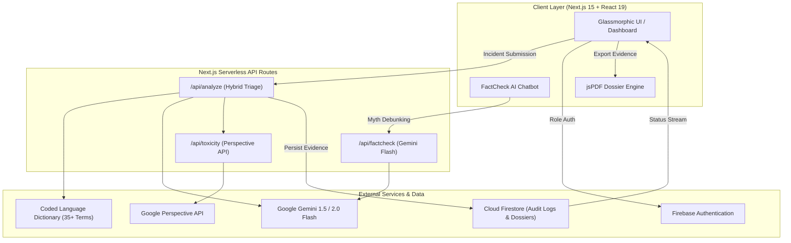

# Daleel (دليل) — AI-Powered Anti-Muslim Hate Speech Detection & Evidence Pipeline

[](https://nextjs.org/)
[](https://www.typescriptlang.org/)
[](https://firebase.google.com/)
[](https://ai.google.dev/)
[](https://tailwindcss.com/)
[](https://opensource.org/licenses/MIT)

> **Daleel (دليل)** — Arabic for *Evidence*, *Guide*, or *Proof* — is an end-to-end Trust & Safety intelligence platform built to detect coded anti-Muslim hate speech, preserve forensically sound digital evidence with chain of custody, and power a 3-tier escalation workflow from grassroots community members to journalists and law enforcement officials.

---

## 📌 Problem Statement

Anti-Muslim hate speech and Islamophobic violence have reached unprecedented global heights, yet traditional content moderation systems systematically fail to detect modern bigotry:

1. **Unprecedented Surge in Hate**: According to the Council on American-Islamic Relations (**CAIR 2024 Report**), civil rights complaints surged by **56% in 2023–2024**, documenting **8,061 verified incidents**—the highest level recorded in CAIR's 30-year history.
2. **Global Under-Reporting & Coded Harassment**: The UK monitoring group **Tell MAMA** recorded **4,971 anti-Muslim hate incidents** following October 2023, with over 65% occurring online. Perpetrators actively bypass keyword filters by deploying linguistic dog whistles, historical slurs, and emoji substitutions (e.g., `🥓`, `🐷`, `"remove kebab"`, `"love jihad"`, `"jizya conspiracies"`).
3. **Evidentiary Black Hole**: Grassroots victims and community monitors lack the technical tools to capture forensically verifiable chain-of-custody evidence before content is deleted or accounts are suspended, leaving journalists and law enforcement unable to act on dangerous escalation patterns.

---

## 💡 Solution Overview: 3-Tier Verification Pipeline

Daleel establishes a verifiable, human-in-the-loop Trust & Safety pipeline that connects three critical stakeholder groups:

```
┌─────────────────────────┐       ┌───────────────────────────┐       ┌───────────────────────────┐
│   Community Reporter    │  ───► │    Journalist Validator   │  ───► │  Official / Enforcement  │
│                         │       │                           │       │                           │
│ • Submits text/URLs/img │       │ • Triages incoming stream │       │ • Reviews verified dossier│
│ • Hybrid AI scan        │       │ • Academic debunk checks  │       │ • Chain of custody audit  │
│ • Instant initial score │       │ • Validates threat level  │       │ • Legal/Takedown exports  │
└─────────────────────────┘       └───────────────────────────┘       └───────────────────────────┘
```

1. **Community Reporters**: Affected individuals or community allies submit suspicious posts, screenshots, or URLs. Daleel executes an instant local regex + dictionary scan across 35+ researched coded terms, augmented by **Google Gemini AI** and **Perspective API** toxicity evaluation.
2. **Journalist Validators**: Accredited media analysts, fact-checkers, and civil rights monitors review incoming incident queues, cross-reference historical counter-narrative databases, annotate evidentiary metadata, and approve or reject submissions.
3. **Officials & Law Enforcement**: Legal advocates, platform Trust & Safety officers, and law enforcement personnel receive forensically packaged evidence dossiers with immutable audit trails for platform takedowns or legal prosecution.

---

## ✨ Key Features

- 🧠 **Hybrid Coded Language Detection**: Researched dictionary containing 35+ anti-Muslim dog whistles, slurs, and geopolitical dog whistles across English, Hindi/Urdu, French, and emoji substitutions (`kebab`, `katwa`, `eurabia`, `stealth jihad`, `islamogauchisme`, `🥓`, `💣`).
- ⚡ **Google Gemini AI Deep Context Analysis**: Semantic analysis that analyzes subtle contextual subtext, historical tropes, and genocidal innuendos that evade keyword blocklists.
- 📊 **Perspective API Multi-Attribute Toxicity Scoring**: Granular quantification of severe toxicity, identity attack, insult, and threat vectors.
- 🔐 **Multi-Role Authentication & Security**: Firebase Auth supporting Google OAuth and Email/Password with role-based access control (`reporter`, `journalist`, `official`).
- 🔄 **Real-Time Chain-of-Custody Tracking**: Cloud Firestore event-sourced state tracking documenting timestamped validations, status changes, reviewer signatures, and audit logs.
- 📄 **Client-Side PDF Evidence Dossier Generation**: High-resolution, multi-page forensic reports generated via `jsPDF` and `html2canvas`, complete with QR codes, cryptographic timestamps, and violation citations.
- 🤖 **Interactive FactCheck AI Chatbot**: Real-time Gemini-powered assistant capable of debunking viral Islamophobic myths, analyzing text/images, and generating shareable social counter-messaging.
- 📚 **Curated Counter-Narrative Archive (50+ Entries)**: Categorized database of academic refutations, theological contexts, and demographic facts citing ISPU, Bridge Initiative, and Pew Research.
- ⏳ **Hate Crime & Policy Timeline**: Chronological historical tracking of 10 major real-world anti-Muslim violence milestones and policy changes to contextualize modern threat escalations.
- 🌐 **Platform-Specific Escalation Guides (8 Platforms)**: Step-by-step reporting protocols tailored for Meta (Facebook/Instagram), YouTube, X (Twitter), TikTok, Reddit, Discord, Telegram, and LinkedIn.
- 🎨 **Glassmorphic Interactive UI**: Dynamic cursor-following flashlight canvas background with seamless toggle between **Greenish Night (Dark)** and **Desert (Light)** themes.

---

## 🛠️ Tech Stack

| Layer | Technology |
|---|---|
| **Framework** | [Next.js 15 (App Router)](https://nextjs.org/) + [React 19](https://react.dev/) |
| **Language** | [TypeScript 5.7](https://www.typescriptlang.org/) |
| **Styling & Design** | [Tailwind CSS v4.0](https://tailwindcss.com/) + Glassmorphism + [Lucide React](https://lucide.dev/) / [React Icons](https://react-icons.github.io/react-icons/) |
| **Artificial Intelligence** | [Google Gemini 1.5 / 2.0 Flash](https://ai.google.dev/) (`@google/generative-ai`) |
| **Toxicity Engine** | [Google Perspective API](https://perspectiveapi.com/) |
| **Authentication & DB** | [Firebase Auth](https://firebase.google.com/products/auth) + [Cloud Firestore](https://firebase.google.com/products/firestore) |
| **Evidence Generation** | [jsPDF](https://github.com/parallax/jsPDF) + [html2canvas](https://html2canvas.hertzen.com/) |

---

## 🏛️ System Architecture



---

## 🚀 Getting Started & Local Setup

### Prerequisites
- Node.js `18.x` or `20.x`+
- npm or yarn / pnpm
- Google Gemini API Key
- Firebase Project credentials
- *(Optional)* Google Perspective API Key

### Installation

1. **Clone the repository**:
   ```bash
   git clone https://github.com/your-username/daleel.git
   cd daleel
   ```

2. **Install dependencies**:
   ```bash
   npm install
   ```

3. **Configure Environment Variables**:
   Create a `.env.local` file in the root directory:
   ```env
   # Google Gemini AI
   GEMINI_API_KEY=your_gemini_api_key_here

   # Perspective API (Optional / Fallback)
   PERSPECTIVE_API_KEY=your_perspective_api_key_here

   # Firebase Client Config
   NEXT_PUBLIC_FIREBASE_API_KEY=your_firebase_api_key
   NEXT_PUBLIC_FIREBASE_AUTH_DOMAIN=your_project.firebaseapp.com
   NEXT_PUBLIC_FIREBASE_PROJECT_ID=your_project_id
   NEXT_PUBLIC_FIREBASE_STORAGE_BUCKET=your_project.appspot.com
   NEXT_PUBLIC_FIREBASE_MESSAGING_SENDER_ID=your_sender_id
   NEXT_PUBLIC_FIREBASE_APP_ID=your_app_id
   ```

4. **Run the development server**:
   ```bash
   npm run dev
   ```

5. **Open in browser**:
   Navigate to [http://localhost:3000](http://localhost:3000) to access the Daleel platform.

---

## 📸 Screenshots

> Screenshots and UI walkthrough recordings can be found in `/docs/screenshots/`.
> 
> - `01_landing_hero.png` — Landing page with live news ticker and cursor light canvas.
> - `02_reporter_view.png` — Incident ingestion with instant coded term flagging.
> - `03_journalist_hub.png` — Multi-incident triage, verification queue, and counter-narrative matching.
> - `04_official_dossier.png` — Official portal with chain of custody timeline and PDF export.
> - `05_factcheck_bot.png` — Interactive FactCheck AI modal with social card generator.

---

## 👥 Team

- **Daleel Development & Research Team** — *Trust & Safety engineering, AI prompt design, and community research.*

---

## 🏆 Hackathon Context

Daleel was conceptualized, designed, and built for **The Harvest Anti-Muslim Hate Hackathon 2026** to pioneer automated, verifiable, and community-centered interventions against online Islamophobia.

---

## 📄 License

This project is licensed under the **MIT License** — see the [LICENSE](./LICENSE) file for details.
