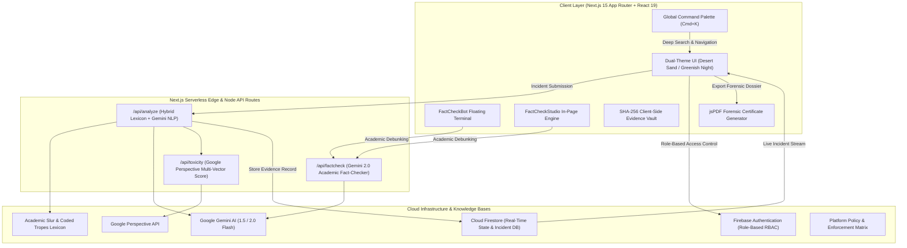

# Daleel (دليل) — Forensic Evidence & Anti-Hate Intelligence Network

[](https://nextjs.org/)
[](https://react.dev/)
[](https://www.typescriptlang.org/)
[](https://firebase.google.com/)
[](https://ai.google.dev/)
[](https://tailwindcss.com/)
[](https://vercel.com/)
[](https://opensource.org/licenses/MIT)

> **Daleel (دليل)** — Arabic for *Evidence*, *Proof*, or *Guide* — is an open-access digital forensics and counter-disinformation intelligence platform. It is engineered to detect coded anti-Muslim hate speech, preserve tamper-evident digital evidence with SHA-256 cryptographic chain of custody, and power an end-to-end triaged escalation pipeline connecting grassroots community witnesses, investigative journalists, and legal enforcement authorities.

---

## 📌 Executive Summary & Problem Context

Online Islamophobia and anti-Muslim disinformation campaigns have reached unprecedented global levels. However, conventional platform content moderation algorithms consistently fail to protect targeted communities:

1. **Surge in Anti-Muslim Hostility**: Civil rights organizations have documented historic increases in anti-Muslim hate crimes and harassment, with civil rights complaints rising over **56% year-over-year** (CAIR 2024 Report, recording 8,061 verified incidents).
2. **Coded Dog-Whistles & Filter Bypass Tactics**: Perpetrators systematically evade automated blocklists and keyword filters by utilizing subtle linguistic tropes, historical revisionism, emoji substitutions (e.g., `🥓`, `🐷`), and coded economic conspiracies (`"halal tax"`, `"creeping sharia"`, `"remove kebab"`, `"stealth jihad"`).
3. **The Evidentiary Gap**: Bad actors frequently delete viral incitement or coordinated harassment posts once offline violence is sparked. Without immutable cryptographic evidence lockers, civil rights litigators, fact-checkers, and law enforcement agencies lack verifiable proof to take legal or platform-level enforcement action.

---

## 💡 The 3-Tier Human-in-the-Loop Pipeline

Daleel bridges the gap between public witnesses and institutional action through a structured, multi-tier chain-of-custody workflow:

```
┌────────────────────────────────┐       ┌────────────────────────────────┐       ┌────────────────────────────────┐
│   Tier 1: Community Reporter   │  ───► │ Tier 2: Journalist Fact-Check  │  ───► │  Tier 3: Official Enforcement  │
│                                │       │                                │       │                                │
│ • Screenshot / URL Ingestion   │       │ • Multi-Incident Newsroom Desk │       │ • Immutable Audit Logs Review  │
│ • Local SHA-256 Fingerprinting │       │ • Academic Lexicon Matching    │       │ • Statutory Notice Generation  │
│ • Hybrid Regex + Gemini Scan   │       │ • Editorial Verification Stamp │       │ • Formal Takedown & Subpoena   │
│ • Instant Community Certificate│       │ • Multi-Platform Syndication   │       │ • Cryptographic PDF Dossiers   │
└────────────────────────────────┘       └────────────────────────────────┘       └────────────────────────────────┘
```

* **Community Reporters**: Upload digital evidence, generate tamper-proof SHA-256 checksums before content can be deleted, and receive real-time forensic threat classifications.
* **Investigative Journalists**: Triage incoming incident streams, match claims against peer-reviewed academic datasets (The Bridge Initiative @ Georgetown, Tell MAMA, ISPU), attach editorial verifications, and syndicate debunks across Substack, Twitter/X, and news feeds.
* **Statutory Officials & Legal Monitors**: Access timestamped incident dossiers with full chain-of-custody audit logs, issue certified compliance warnings, and export tamper-evident forensic PDF certificates with verifiable QR codes.

---

## 🏛️ System Architecture



---

## ✨ Core Modules & Platform Capabilities

### 1. 🔍 Hybrid Coded Language & Disinformation Detection Engine
* **Researched Dog-Whistle Lexicon**: Proprietary catalog of 40+ anti-Muslim slurs, historical revisionist tropes, and emoji substitutions across English, Hindi/Urdu, French, and German.
* **Semantic Context Analysis via Google Gemini AI**: Evaluates nuanced sarcasm, dog-whistles, and dehumanizing metaphors that bypass conventional regex filters.
* **Perspective API Multi-Vector Toxicity Scoring**: Quantifies severe toxicity, identity attacks, insults, profanity, and threat levels.

### 2. ⚡ Real-Time Fact-Check Studio & Floating AI Bot
* **Academic Citations**: Debunks claims in real-time by cross-referencing research from **The Bridge Initiative (Georgetown University)**, **ISPU**, **Tell MAMA UK**, and the **UN International Criminal Tribunal**.
* **One-Click Counter-Narrative Sharing**: Instantly format factual rebuttals for X/Twitter, WhatsApp, LinkedIn, and Substack.
* **Embeddable Fact-Check Widget**: Allows independent newsrooms, student newspapers, and blogs to embed Daleel's verified fact-checking terminal with a 2-line snippet.

### 3. 📊 Threat Heatmap & Surge Velocity Tracking
* Real-time monitoring of active disinformation clusters (e.g., *"Halal Tax Conspiracies"*, *"Demographic Replacement"*, *"Taqiyya Inversion"*).
* 24-hour surge velocity percentages (`+68% spike`, `+42% surge`) and cross-platform spread breakdowns (X/Twitter, TikTok, Meta, Telegram, YouTube).

### 4. ⚖️ Big Tech Platform Accountability Scorecard
* Evaluates 8 major platforms (X/Twitter, Meta, TikTok, YouTube, Reddit, Discord, Telegram, LinkedIn) across 5 rigorous metrics:
  * Coded Slur Enforcement
  * Appeal Transparency
  * Response Time to Incitement
  * Independent Researcher Data Access
  * State Media & Botnet Transparency

### 5. 📜 SHA-256 Digital Fingerprint Evidence Locker & Forensic PDF Export
* Generates browser-side SHA-256 cryptographic hashes for captured visual screenshots and text payloads.
* Generates court-ready, multi-page forensic PDF dossiers via `jsPDF` with verification QR codes, incident timelines, and platform policy citations.

### 6. 🎨 Dual-Theme Architecture (Desert Sand & Greenish Night)
* **Desert Sand Mode (Warm Light)**: Creamy sand bisque (`#f7efe4`), warm white (`#fdfaf5`), and rich espresso text (`#1e140d`).
* **Greenish Night Mode (Emerald Dark)**: Deep midnight slate (`#090d16`), emerald accents (`#10b981`), and high-contrast text (`#f8fafc`).
* Custom Tailwind CSS v4 `@custom-variant dark (&:where(.dark, .dark *));` engine guaranteeing zero theme flash or OS-level overrides.

### 7. 📱 Mobile-First Responsive Design
* Native touch-optimized bottom sheets for the FactCheckBot on mobile screens.
* Responsive card stacks, touch-friendly tab filters, and overflow-contained dialogs across small phones (360px–430px), tablets (768px), and desktops (1280px+).

---

## 🛠️ Technology Stack

| Domain | Technology | Purpose |
|---|---|---|
| **Frontend Framework** | [Next.js 15 (App Router)](https://nextjs.org/) + [React 19](https://react.dev/) | Server Components, fast hydration, API endpoints |
| **Language** | [TypeScript 5.7](https://www.typescriptlang.org/) | Full-stack type safety |
| **Styling & Theming** | [Tailwind CSS v4.0](https://tailwindcss.com/) | Custom variants, responsive layouts, dual-theme styling |
| **AI & NLP** | [Google Gemini 2.0 / 1.5 Flash](https://ai.google.dev/) (`@google/genai`) | Semantic claim debunking & coded slur extraction |
| **Toxicity Analysis** | [Google Perspective API](https://perspectiveapi.com/) | Granular hate speech and identity attack quantification |
| **Auth & Database** | [Firebase Auth](https://firebase.google.com/) + [Cloud Firestore](https://firebase.google.com/products/firestore) | Role-based authentication (RBAC) and immutable event storage |
| **Forensic PDF Export** | [jsPDF](https://github.com/parallax/jsPDF) + [html2canvas](https://html2canvas.hertzen.com/) | Tamper-evident PDF certificate generation with QR stamps |
| **Icons & Media** | [Lucide React](https://lucide.dev/) + [React Icons](https://react-icons.github.io/react-icons/) | Semantic iconography |
| **Production Hosting** | [Vercel](https://vercel.com/) | Serverless functions, edge routing, Brotli/Gzip compression |

---

## 🚀 Getting Started & Local Development

### Prerequisites
* **Node.js**: `v18.18+` or `v20.x`
* **Package Manager**: `npm`, `pnpm`, or `yarn`
* **Google Gemini API Key**: [Get an API Key](https://aistudio.google.com/)
* **Firebase Project**: [Firebase Console](https://console.firebase.google.com/)

### 1. Clone the Repository
```bash
git clone https://github.com/nizamulhaq500/daleel.git
cd daleel/postbunk
```

### 2. Install Dependencies
```bash
npm install
```

### 3. Configure Environment Variables
Create a `.env.local` file in the root of the project:
```env
# Google Gemini API
GEMINI_API_KEY=your_gemini_api_key_here

# Perspective API (Optional / Fallback)
PERSPECTIVE_API_KEY=your_perspective_api_key_here

# Firebase Web Client Configuration
NEXT_PUBLIC_FIREBASE_API_KEY=your_firebase_api_key
NEXT_PUBLIC_FIREBASE_AUTH_DOMAIN=your_project.firebaseapp.com
NEXT_PUBLIC_FIREBASE_PROJECT_ID=your_project_id
NEXT_PUBLIC_FIREBASE_STORAGE_BUCKET=your_project.appspot.com
NEXT_PUBLIC_FIREBASE_MESSAGING_SENDER_ID=your_sender_id
NEXT_PUBLIC_FIREBASE_APP_ID=your_app_id
```

### 4. Run the Local Development Server
```bash
npm run dev
```
Open [http://localhost:3000](http://localhost:3000) in your browser.

### 5. Build for Production
```bash
npm run build
npm run start
```

---

## 🔌 API Routes Reference

### `POST /api/analyze`
Accepts text, image URL, and platform metadata. Runs dictionary scan, Google Gemini contextual review, and Perspective API toxicity check.
```json
{
  "text": "Viral post content claiming halal certification funds militancy...",
  "platform": "x",
  "url": "https://x.com/example/status/123"
}
```

### `POST /api/factcheck`
Queries the Gemini 2.0 Flash engine with prompt engineering grounded in academic and historical datasets to generate factual refutations.
```json
{
  "query": "Is halal certification an economic jihad tax?"
}
```

### `POST /api/toxicity`
Returns raw Perspective API attribute vectors: `TOXICITY`, `SEVERE_TOXICITY`, `IDENTITY_ATTACK`, `INSULT`, and `THREAT`.

---

## 🔒 Security & Privacy Policy

* **Immutable Chain of Custody**: Evidence records stored in Cloud Firestore utilize append-only event logging for all verification state transitions.
* **Cryptographic Data Protection**: SHA-256 hashes are computed client-side before submission to prove zero post-capture modification.
* **Privacy & Ethics Contact**: For privacy inquiries, research collaborations, or data deletion requests, email `daleeel.project@gmail.com`.

---

## 📄 License

This project is licensed under the **MIT License** — see the [LICENSE](./LICENSE) file for details.

